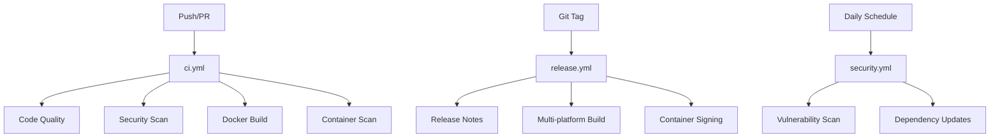

# GitHub Actions Workflows Summary

## Current Workflows

### ✅ **ci.yml** - Main CI/CD Pipeline
**Purpose**: Comprehensive CI/CD pipeline for every push and PR
**Triggers**: Push to main/develop, PRs to main, weekly security scan
**Key Features**:
- Code quality checks (Hadolint, ShellCheck, YAML lint)
- Security scanning (Gitleaks, CodeQL, Trivy)
- Dependency review for PRs
- Docker build & push with SHA versioning
- SBOM generation and container signing
- Multi-platform builds (amd64/arm64)
- Automated PR comments

**Status**: ✅ Optimized and secure

---

### ✅ **release.yml** - Release Pipeline
**Purpose**: Production releases with semantic versioning
**Triggers**: Git tags (v*.*.*)
**Key Features**:
- Automated changelog generation
- GitHub release creation
- Multi-platform container builds
- Container signing and attestation
- SBOM attachment
- Helm chart publishing (ready for future)

**Status**: ✅ Production-ready

---

### ✅ **security.yml** - Security Monitoring
**Purpose**: Daily security scans and dependency updates
**Triggers**: Daily at 2 AM UTC, manual dispatch
**Key Features**:
- OWASP Dependency Check
- Multi-scanner vulnerability detection (Grype, Trivy, Snyk)
- Automated issue creation for vulnerabilities
- Base image update checking
- Automated dependency update PRs

**Status**: ✅ Monitoring active

---

## Removed Workflows

### ❌ **docker-image.yml** (REMOVED)
**Reason**: Deprecated, replaced by ci.yml with better practices

### ❌ **sonarqube-analysis.yml** (REMOVED)
**Reason**: Redundant with SonarCloud integration in ci.yml

### ❌ **docker-build-push.yml** (REMOVED)
**Reason**: Functionality consolidated into ci.yml

---

## Key Improvements Made

### 🔒 **Security Enhancements**
- All action versions pinned to specific releases
- Added dependency review for PRs
- Container signing with Cosign
- SBOM generation for supply chain security
- Comprehensive vulnerability scanning

### ⚡ **Performance Optimizations**
- Concurrency control to prevent duplicate runs
- Efficient caching strategies
- Parallel job execution
- Conditional job execution

### 🎯 **DevOps Best Practices**
- SHA-based versioning for immutable deployments
- Automated changelog generation
- Multi-platform container builds
- Automated cleanup of old artifacts
- Proper secret management

### 📊 **Monitoring & Feedback**
- SARIF upload to GitHub Security tab
- Automated PR comments with results
- Issue creation for security findings
- Build status notifications

---

## Configuration Files

### Required Secrets
```
DOCKER_USERNAME      # Docker Hub username
DOCKER_PASSWORD      # Docker Hub password
SONAR_TOKEN         # SonarCloud token
SNYK_TOKEN          # Snyk token (optional)
GITLEAKS_LICENSE    # Gitleaks license (optional)
```

### Supporting Files
- `sonar-project.properties` - SonarCloud configuration
- `.github/cliff.toml` - Changelog generation config
- `.github/dependabot.yml` - Dependency update automation

---

## Workflow Dependencies



---

## Next Steps

1. **Setup Secrets**: Configure all required secrets in repository settings
2. **SonarCloud**: Connect repository to SonarCloud for code quality analysis
3. **Branch Protection**: Enable branch protection rules requiring status checks
4. **Notifications**: Configure team notifications for security alerts
5. **Monitoring**: Set up dashboards for CI/CD metrics

---

## Validation Status

- ✅ YAML syntax validated
- ✅ GitHub Actions syntax verified
- ✅ Security best practices implemented
- ✅ No deprecated actions
- ✅ Proper permissions configured
- ✅ Redundancy eliminated
- ✅ Version pinning implemented